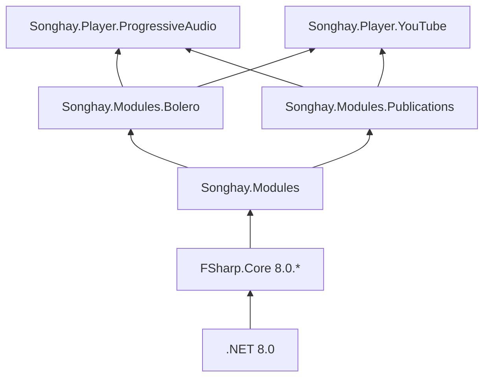

# Songhay.Modules

## core reusable, opinionated concerns for all 🧐 of my F# projects

The _Core_ F# Modules to install as [a NuGet package](https://www.nuget.org/packages/Songhay.Modules/) for _all_ of my F#-based studio Solutions. Anyone who may be reading this 👀 is free to do the same. This repository largely translates my C#-based core, `SonghayCore` [[GitHub](https://github.com/BryanWilhite/SonghayCore)], as the need arises.

**NuGet package 📦:** [`Songhay.Modules`](https://www.nuget.org/packages/Songhay.Modules/)

## _core_ reusable, opinionated concerns

The following highlights core concerns shared among my F# projects:

- binding literals to selected MIME types (see [`MimeTypes`](./Songhay.Modules/MimeTypes.fs))
- functions with `HttpClient`, `HttpRequestMessage` and `HttpResponseMessage` (see [tests](./Songhay.Modules.Tests/HttpClientUtilityTests.fs) for examples)
- functions handling Microsoft’s `JsonDocument` (see [`JsonDocumentUtility`](./Songhay.Modules/JsonDocumentUtility.fs))
- centralizing routines around handling files and directories (see [tests](./Songhay.Modules.Tests/ProgramFileUtilityTests.fs))
- centralizing routines around handling strings (see [tests](./Songhay.Modules.Tests/StringUtilityTests.fs))
- functions for CSS declarations (see [`CssDeclarationUtility`](./Songhay.Modules/CssDeclarationUtility.fs))

## Studio packages dependent on `Songhay.Modules`

@[BryanWilhite](https://twitter.com/BryanWilhite)
